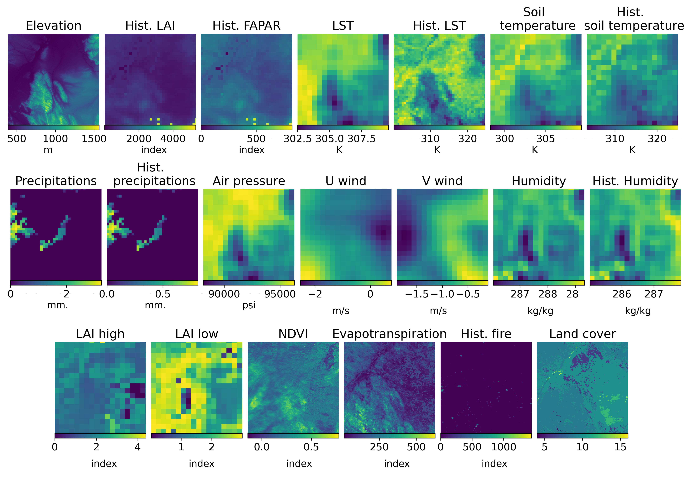
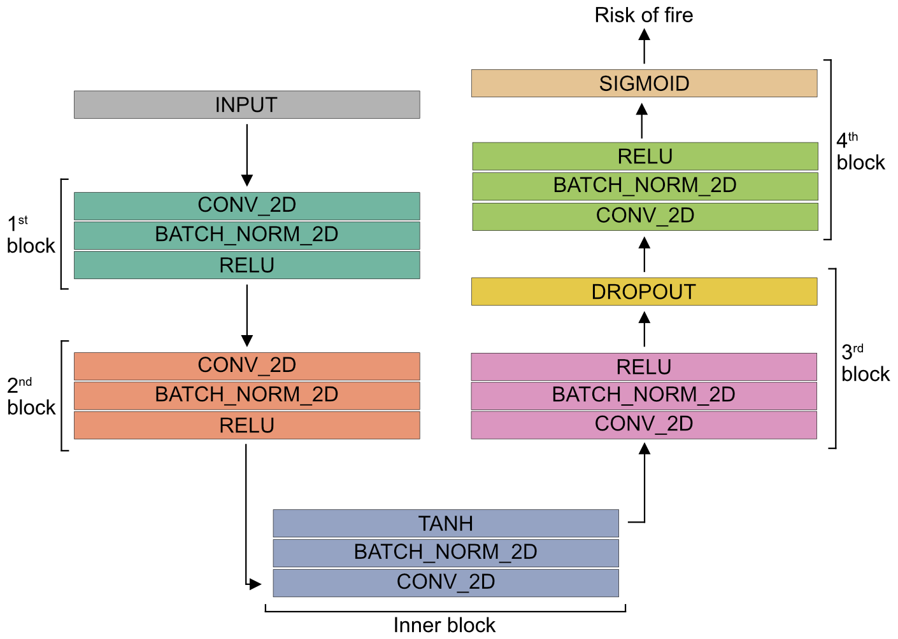
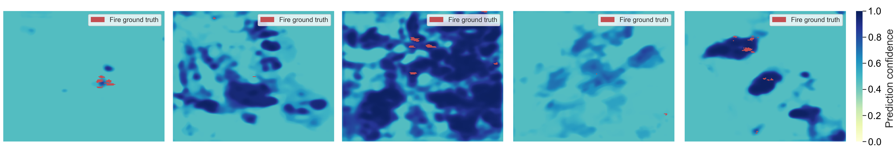

# MSc Thesis on Wildfire risk assessment using remote sensing data

## Table of Contents
1. [Introduction](#introduction)
2. [Abstract](#abstract)
3. [Dataset](#dataset)
4. [Methods](#methods)
5. [Results](#results)
6. [Conclusions](#conclusions)
7. [Preprocessing](#preprocessing)
8. [Errors](#errors)

## Introduction
Hi to whoever ends up here on this webpage. Here there is the material I used for my master thesis. You're free to use the code and check what I have done. 
> What have I done in a few words? I have built a machine learning model (CNN) capable of assessing the risk of a wildfire over the entire globe using remote sensing data.

> The model presented here was able to predict wildfires in the US with an 80% score and a lower score for the rest of the world.

## Abstract
Assessing the risk of wildfires over the entire globe can be crucial in avoiding harm to wildlife, economy, properties and humans. This is known to be a challenging task. Here, a machine learning model is trained on a dataset composed of remote sensing data variables such as topography, vegetation and weather. The model is able to assess the risk of fire with a spatial resolution of 1000m/pixel. It achieves optimal results compared to other state-of-the-art architectures. Most of the variables in the dataset are found to be critical for the task, while few were disregarded. Particular focus has been given to collecting data across a variety of landscapes. Specifically, samples from Africa, Australia, Asia, Europe, South America and the US are included. This research shows the potential for deploying global wildfire risk assessment applications.

## Dataset
[Download training dataset](https://huggingface.co/datasets/beppemar/Wildfire-dataset)


Using Google Earth Engine (GEE), each image is extracted from different areas around the globe, from the years 2018, 2019 and 2020. In particular, focus has been given to fire seasons in Africa, Asia, Australia, Europe, South America and USA. The following picture illustrates the extraction points:


Each image extracted has 20 features, an example is shown below:



## Methods
The CNN architecture consists in multiple blocks of convolutional, batch normalisation, and activation layers as illustrated in the following Figure. Each convolutional layer retains the original size of the image while increasing the number of filters. These are 40, 60, 30 and 1 respectively for the first, second, third and fourth block. The inner blocks uses a tanh activation function while the other blocks rely on the ReLU activation function. The last layer converts the outputs of the precedent ones to a single filter through a sigmoid activation function. The model has 587,177 parameters in total.



## Results
The following picture shows 5 examples of wildfire prediction from the CNN.


## Conclusions
Overall, this research has shown that a simple CNN can be successful in predicting the risk of wildfires in areas around the globe. Improving this technique and using it on a larger scale could save damage to the economy, properties, wildlife and humans. This especially holds true in areas with poor wildfire management. Although there are some drawbacks regarding the availability and frequency of the data, satellite data is an essential resource for this and other similar applications. An attempt to deploy the model on GEE has been made, but given time constraints and the high cost, it has been dismissed.

Future work will focus on:
- improving the GEE algorithm for extracting samples such that there is no overlap between samples;
- exploring higher temporal and spatial resolution sources, for instance PlanetScope Dove. It provides daily high resolution images (between 3m and 5m/pixel). High costs are expected with this type of workflow;
- comparing multiple loss functions (e.g. Tversky Loss, Lovasz Hinge Loss, Combo Loss);
- further investigating the feature space of the dataset by first iteratively deleting a feature from the dataset and then training the model;
- inspecting in more details the reason why the model mislabels a fire instance as a no fire instance;
- deploying the model on GEE.

## Preprocessing
Problems with the data:

- The data from the tif files present a lot of NaN values. This is due to clouds and 
satellite data not always being clear. We need to clean them before we can use them.
- Each image is not 200x200. We need to crop the image to 200x200 to fit into the model.
- The data is not normalised. We need to normalise the data before we can use it.

You can find the preprocessing script in the `src` folder.

## Errors

You may find the following errors by running the GEE script:

```
Line 40: your_geometry_name is not defined
```
In order to generate fire instances, you need to create a geometry on the map and add its name in the script.


```
List.get: List index must be between 0 and 18, or -19 and -1. Found 19.
```
Given that the number of fire instances is not always assured, this error pops up. No worries, it just tells that there are not enough fire instances for that area for the selected period of time.
